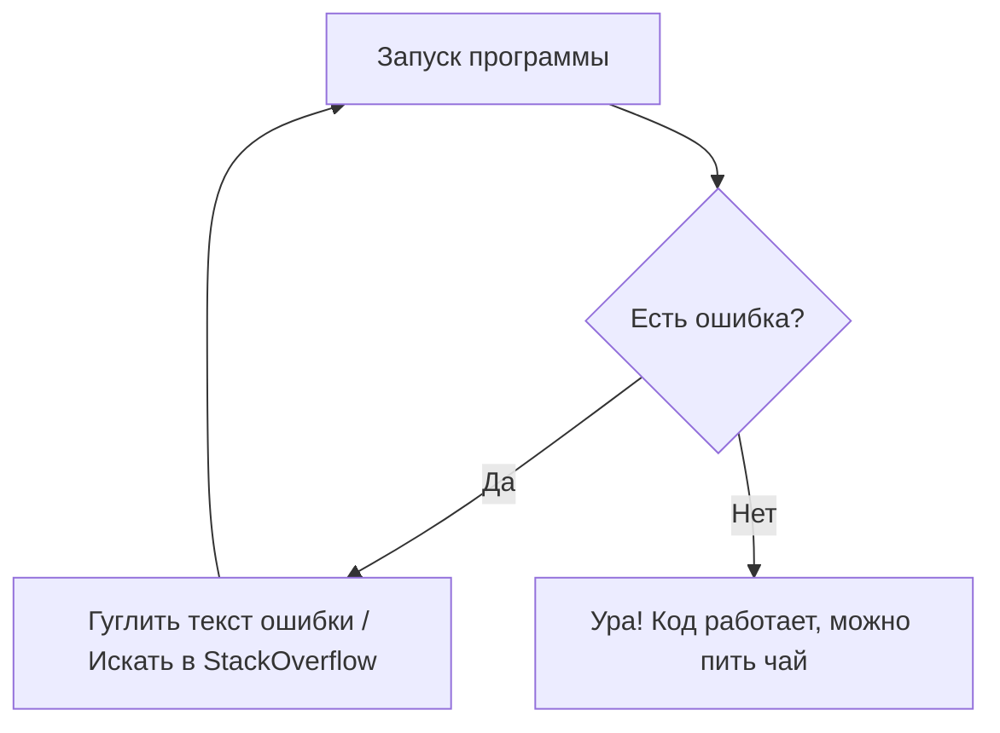

# 🚀 Руководство по выживанию для начинающего разработчика
## 📚 Как не сойти с ума в мире кода и технологий
### Практическое пособие по организации рабочего процесса

Каждый новичок сталкивается с огромным потоком информации. Данная статья призвана разложить базовые принципы по полочкам, используя возможности разметки Markdown.

#### Раздел 1. Ментальный настрой
##### Подраздел: Работа над ошибками
###### Минутка мотивации
Помните, что не ошибается только тот, кто ничего не пишет!

---

Выделение текста
----------------
В процессе обучения важно правильно расставлять акценты. Запомните следующие правила:
* Изучайте базу тщательно* (ведь основы — это ваш фундамент).
_Не бойтесь задавать вопросы_ на форумах.
**Никогда не копируйте код вслепую**, всегда разбирайтесь, как он работает.
__Пользуйтесь системой контроля версий Git__ с первого дня.
***Регулярный отдых и сон*** — это залог продуктивности, а не пустая трата времени.
___Выгорание___ — реальная проблема, берегите себя.
Если подход не работает, значит он ~~устарел~~ требует оптимизации.
Всегда используйте `git commit` для сохранения прогресса, а не храните всё в одной папке.

Списки
------
Что необходимо сделать в первую неделю обучения:
- Настроить рабочее окружение
- Выбрать редактор кода
  - Установить плагины
  - Настроить тему оформления
* Изучить основы командной строки
+ Найти ментора или учебное сообщество

План развития на месяц:
1. Изучить синтаксис выбранного языка
2. Написать первое консольное приложение
3. Разобраться с Git и GitHub
   1. Создать аккаунт
   2. Загрузить первый репозиторий

Чек-лист проекта (интерактивный список задач):
- [x] Создать репозиторий на GitHub
- [ ] Написать чистый код без багов
- [ ] Оформить документацию

Ссылки
------
Полезные ресурсы для старта:
[Официальный сайт Python](https://python.org)  
[Документация GitHub](https://github.com "Перейти к руководству по GitHub")  
Быстрая ссылка на авто-валидатор кода: <https://pep8online.com>  

Если вам нужны качественные референсы, загляните в [Полезный справочник][1].: https://habr.com

Картинки
--------
Визуализация рабочего пространства разработчика:


Кликните по картинке ниже, чтобы найти вдохновение для оформления своего рабочего стола:
[](https://ru.pinterest.com/ideas/обои-для-рабочего-стола-компьютера/929790009455/)

Цитата
------
> "Пишите код так, как будто сопровождать его будет склонный к насилию психопат, который знает, где вы живете."
> — Мартин Голдинг
> 
> > И помните: Чистый код читается как хорошая проза.

Код
---
Пример вывода первой программы на языке разметки Markdown:
```markdown
print("Hello") Python
```

А вот так выглядит правильная функция сложения и форматированного вывода на Python:
```python
a = 5
b = 10
c = a + b
print(f"{c} = {a} + {b}")
```

Таблицы
-------
Сравнение популярных языков программирования для новичков:

| Название языка | Сложность | Область применения |
|-----:|:---:|:----------|
| Python | 2/10 | Data Science, Web, Scripting |
| JavaScript | 4/10 | Frontend, Backend Web |
| C++ | 9/10 | GameDev, High-Load, OS |
| Итого | Средняя | Выбирайте под свои задачи |

Линии
-----
Ниже представлены примеры разделения блоков контента:

---

***

___

Экранирование
-------------
Если вам нужно отобразить служебные символы Markdown как обычный текст, используйте обратный слэш:
Вывод хештега: \# это не заголовок, а просто текст.  
Вывод квадратных скобок: \[ это обычные скобки, а не ссылка \].

Диаграмма
---------
Алгоритм принятия решений при поиске багов в коде:



Заголовки (Навигация)
---------
Быстрые переходы по статье:
- [Вернуться к Ментальному настрою](#раздел-1-ментальный-настрой)
- [Посмотреть Списки задач](#списки)
